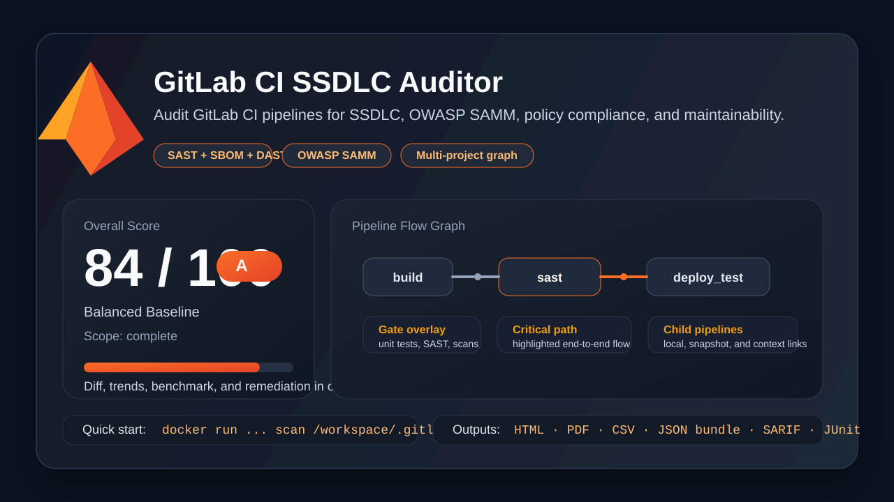

# GitLab CI SSDLC Auditor

[](https://github.com/polishyankee/Gitlab-CI-Auditor/actions/workflows/ci.yml)
[](https://github.com/polishyankee/Gitlab-CI-Auditor/actions/workflows/release.yml)
[](https://github.com/polishyankee/Gitlab-CI-Auditor/releases)
[](https://github.com/polishyankee/Gitlab-CI-Auditor/pkgs/container/gitlab-ci-auditor)

Audit GitLab CI pipelines for SSDLC, OWASP SAMM, SAST/SBOM/DAST coverage, policy compliance, and maintainability. The tool inspects `.gitlab-ci.yml`, local includes, multi-project context, downstream snapshots, and script-backed evidence, then produces actionable findings, flow graphs, benchmark views, and machine-readable exports.



## Why Teams Use It

- detect missing unit tests, coverage, SAST, SBOM, secret-detection, IaC, DAST, and test deployment gates
- verify every reachable pipeline path derived from `workflow`, `rules`, `rules:changes`, `only/except`, branches, tags, and downstreams
- benchmark pipeline evidence against OWASP SAMM v2 `Implementation`
- visualize the real pipeline flow graph with gate overlays and critical path highlighting
- export reports for people and automation through `HTML`, `PDF`, `CSV`, `JSON bundle`, `SARIF`, and `JUnit`

## Quick Start

Run the auditor in Docker against the current repository and generate an HTML report in one command:

```bash
docker pull ghcr.io/polishyankee/gitlab-ci-auditor:latest
docker run --rm \
  --user "$(id -u):$(id -g)" \
  -v "$PWD:/workspace" \
  ghcr.io/polishyankee/gitlab-ci-auditor:latest \
  scan /workspace/.gitlab-ci.yml --format html --output /workspace/report.html
```

Open the local GUI:

```bash
docker run --rm -p 4567:4567 ghcr.io/polishyankee/gitlab-ci-auditor:latest
```

Or use the local checkout directly:

```bash
chmod +x ./bin/gitlab-ci-auditor
./bin/gitlab-ci-auditor scan .gitlab-ci.yml
```

## What You Get

- SSDLC findings with issue, recommendation, and concrete remediation
- security-policy findings with organization-specific severity tuning
- static lint and best-practices feedback for `.gitlab-ci.yml`
- interactive flow graph and multi-project context visualization
- OWASP SAMM `Secure Build`, `Secure Deployment`, and `Defect Management` benchmark mapping
- CI-ready exports for `SARIF` and `JUnit`

## Sample Inputs and Reports

- browse pipeline examples and bundled report artifacts in [examples/README.md](/Users/polishyankee/Desktop/Devops-1/projects/gitlab-ci-ssdlc-auditor/examples/README.md)
- inspect the strong baseline input in [examples/pipelines/compliant_service.gitlab-ci.yml](/Users/polishyankee/Desktop/Devops-1/projects/gitlab-ci-ssdlc-auditor/examples/pipelines/compliant_service.gitlab-ci.yml)
- inspect the intentionally weak baseline input in [examples/pipelines/legacy_monolith.gitlab-ci.yml](/Users/polishyankee/Desktop/Devops-1/projects/gitlab-ci-ssdlc-auditor/examples/pipelines/legacy_monolith.gitlab-ci.yml)
- use [docs/GITHUB_METADATA.md](/Users/polishyankee/Desktop/Devops-1/projects/gitlab-ci-ssdlc-auditor/docs/GITHUB_METADATA.md) for the exact GitHub `About`, topics, and social-preview settings

## Highlights

- fail-fast validation for malformed or unsupported custom policy packs
- machine-readable `SARIF` and `JUnit` exports for CI integration
- stack-aware SAST policy enforcement driven by policy packs
- explicit artifact and container scan family detection
- diff mode for comparing two pipeline revisions
- organization-specific severity tuning through policy files
- graph legend, gate overlays, and critical-path highlighting in the HTML report
- first-class SBOM, secret-detection, IaC, and DAST controls
- multi-project graph ingestion through JSON context manifests
- historical trend dashboards through a persistent JSON history store
- OWASP SAMM v2 `Implementation` benchmark in GUI and exported reports
- richer `Observed Detection Signals` and explicit auditor-to-SAMM rule mapping in the benchmark tab
- question-level mapping for all 18 OWASP SAMM `Implementation` questions from the upstream `core` repository

## What It Checks

- unit test execution
- coverage reporting
- SAST coverage
- artifact scanning or image scanning
- SBOM evidence for build outputs
- secret detection
- IaC and deployment-policy scanning
- DAST against deployed environments
- automated deployment to a test environment
- baseline security policy compliance
- OWASP SAMM v2 `Implementation` benchmark alignment
- pipeline complexity and maintainability
- active execution paths derived from `workflow`, `rules`, `rules:changes`, `only/except`, branches, and tags

## Scan Scope

The auditor evaluates the full local pipeline graph, not just the root file:

- recursively expands local `include`
- scans child/downstream pipelines started by `trigger: include: - local: ...`
- follows nested local child pipelines as long as the referenced files are available locally
- can import external or artifact-based downstream pipelines through local YAML snapshot manifests
- can join multiple repositories into one graph through a JSON context manifest

If a downstream pipeline depends on `project`, `artifact`, `template`, or another external mechanism, the report marks the analysis as partial and explains the gap with remediation guidance.

## Unit Test Heuristics

The unit-test control is considered satisfied not only by a dedicated test job, but also when:

- a Maven job runs `mvn test|verify|package|install|deploy` or `./mvnw ...` without `-DskipTests` and without `-Dmaven.test.skip`
- a Gradle job runs `gradle` or `./gradlew` with `test|build|check` without `-x test` and without `--exclude-task test`
- `artifacts` contains JaCoCo evidence such as `jacoco.exec` or `jacoco.xml`

Coverage reporting is tracked separately from plain test execution. The auditor recognizes common artifacts such as JaCoCo, Cobertura, and LCOV outputs.

## SAST Heuristics

The SAST control recognizes both GitLab SAST templates and common stack-specific scanners. The current heuristics cover:

- Java: `spotbugs`, `findsecbugs`, `SonarQube` via `sonar-scanner` or `mvn sonar:sonar`, `semgrep`, `codeql`
- .NET: `dotnet sonarscanner`, `SonarScanner.MSBuild.exe`, `Security Code Scan`, `semgrep`, `snyk code test`
- Node / JS: `semgrep`, `njsscan`, `nodejsscan`, `SonarQube` via `sonar-scanner`, `snyk code test`
- Python: `bandit`, `semgrep`, `codeql`
- Go: `gosec`, `semgrep`, `codeql`
- Ruby: `brakeman`, `semgrep`, `codeql`
- PHP: `psalm --taint-analysis`, `progpilot`, `semgrep`, `codeql`

When SAST is missing, remediation guidance is adapted to the stacks detected from the pipeline definition.

The auditor now also expands local shell scripts referenced by jobs. If a job only runs `bash ci/trivy.sh` or `bash scripts/sonar.sh`, the analyzer reads the local script file from the selected repository bundle and uses its contents as evidence for SAST, scanning, secret-management, integrity verification, and deployment heuristics.

Bundled policy packs also define `stack_sast_requirements`, so a generic SAST job is no longer enough when the detected stack expects different tooling. For example:

- a Node / JS pipeline with only `spotbugs` is treated as incomplete
- a Python pipeline with only `findsecbugs` is treated as incomplete
- a polyglot repository can satisfy the gate with a mix of accepted families, for example `dotnet sonarscanner` for .NET and `njsscan` for Node / JS

The current built-in rule packs expose stack-specific accepted families for .NET, Node / JS, Java, Python, Go, Ruby, and PHP.

## Artifact and Image Scan Heuristics

The scan control is satisfied when at least one enforcing artifact or image scan is present on the supported pipeline path.

Accepted artifact or dependency scan signals:

- `dependency-scanning`
- `dependency-check`
- `trivy fs`
- `grype`
- `snyk test`
- `license-scanning`

Accepted container or image scan signals:

- `container-scanning`
- `trivy image`
- `grype`
- `docker scan`
- `snyk container`
- `anchore`

The report metadata also lists which scanner families were detected so you can see what the auditor actually recognized.

This matters for wrapper jobs such as `trivy_dependency` that delegate the actual scanning logic into `trivy.sh`. If the script is present in the analyzed repository or uploaded bundle, the auditor now inspects it instead of relying only on the job name.

In the GUI and exported reports, the detected security tooling is broken out into:

- SAST families
- artifact or dependency scan families
- image scan families
- SBOM families
- secret-detection families
- IaC scan families
- DAST families
- secret-management signals
- integrity-verification signals

## SBOM, Secret Detection, IaC, and DAST Heuristics

The extended control set is now policy-aware and visible in both scenario scoring and category scoring.

Accepted SBOM signals include:

- `syft`
- `cdxgen`
- `trivy sbom`
- `snyk sbom`
- CycloneDX or SPDX artifacts in `artifacts.paths`

Accepted secret-detection signals include:

- GitLab Secret Detection
- `gitleaks`
- `trufflehog`
- `detect-secrets`

Accepted IaC or deployment-policy signals include:

- `checkov`
- `tfsec`
- `terrascan`
- `kics`
- `trivy config`
- `conftest`
- `kubeconform`
- `kube-score`
- `datree`
- `ansible-lint`

Accepted DAST signals include:

- GitLab DAST
- `OWASP ZAP` via `zap-baseline.py` or `zap-full-scan.py`
- `StackHawk`
- `Burp`
- `Nikto`

Applicability is not binary across every repository:

- SBOM is only required when the pipeline shows build-output or package-production signals
- IaC is only required when the pipeline shows deployment-configuration or infrastructure-code signals
- DAST is only required when a deployable or web-facing surface is visible
- secret detection is treated as a generally applicable repository baseline

## Multi-Project Context

For cases where the application pipeline, deployment pipeline, or delivery repository live in separate Git repositories, use `--context-file` with a JSON manifest that maps projects and links jobs between them.

Minimal example:

```json
{
  "root_project": "application",
  "projects": [
    { "name": "delivery", "root": "delivery/.gitlab-ci.yml" }
  ],
  "links": [
    {
      "from_project": "application",
      "to_project": "delivery",
      "trigger_job_name": "handoff_to_delivery",
      "kind": "multi_project_context"
    }
  ]
}
```

This lets the graph show a single end-to-end flow even when build evidence, deployment evidence, and DAST or IaC checks come from different repositories.

## Historical Trends

Use `--history-file` to append each scan to a persistent JSON store. When a history file is present, the report adds a `Trends` tab with:

- recent runs
- previous score and score delta
- category drift
- benchmark drift

This is useful for tracking whether SSDLC posture is improving over time rather than only looking at the latest point-in-time scan.

## OWASP SAMM v2 Benchmark

The HTML, CSV, JSON bundle, and text exports now include a pipeline-derived benchmark for the OWASP SAMM v2 `Implementation` business function, focused on:

- `Secure Build`
- `Secure Deployment`
- `Defect Management`

This is intentionally an estimate from static pipeline evidence, not a full organizational SAMM assessment. The benchmark explains:

- the estimated maturity level from `0` to `3`
- the alignment score from `0` to `100`
- the observed detection signals used to justify the estimate
- the concrete auditor rules mapped to each SAMM practice
- the upstream `Implementation` question mapping used for `Secure Build`, `Secure Deployment`, and `Defect Management`
- the good signals visible in the pipeline
- the gaps still visible from CI/CD automation
- the official OWASP SAMM reference URL for each practice

The current implementation now maps all 18 question files from OWASP SAMM section `I`:

- `I-SB-*` for `Secure Build`
- `I-SD-*` for `Secure Deployment`
- `I-DM-*` for `Defect Management`

Each mapped question is labeled with:

- a status such as `pass`, `warn`, `fail`, or `review`
- an `observability` level showing whether the question is directly visible, only partially visible, or fundamentally review-oriented from pipeline evidence
- a concrete explanation of what was or was not detected
- a static limitation note when the pipeline alone cannot prove the full maturity claim

This makes the SAMM benchmark more explicit about what the auditor can truly verify from `.gitlab-ci.yml` and what still needs evidence from ticketing, IAM, secret-management, reporting, or governance systems.

The benchmark is available in:

- the HTML GUI report as a dedicated `OWASP SAMM` tab
- text export
- CSV export
- JSON bundle export

The roadmap item about expanding beyond SAMM `Implementation` remains intentionally open. The auditor now covers `Implementation` in depth at the question level, but additional business functions still need separate source modeling where CI/CD evidence is actually meaningful.

## Run

CLI:

```bash
chmod +x ./bin/gitlab-ci-auditor
./bin/gitlab-ci-auditor scan .gitlab-ci.yml
```

List bundled policy packs:

```bash
./bin/gitlab-ci-auditor list-packs
```

HTML report:

```bash
./bin/gitlab-ci-auditor scan .gitlab-ci.yml --format html --output report.html
```

CSV export:

```bash
./bin/gitlab-ci-auditor scan .gitlab-ci.yml --format csv --output report.csv
```

PDF export:

```bash
./bin/gitlab-ci-auditor scan .gitlab-ci.yml --format pdf --output report.pdf
```

JSON bundle export:

```bash
./bin/gitlab-ci-auditor scan .gitlab-ci.yml --format json-bundle --output report.bundle.json
```

SARIF export:

```bash
./bin/gitlab-ci-auditor scan .gitlab-ci.yml --format sarif --output report.sarif.json
```

JUnit export:

```bash
./bin/gitlab-ci-auditor scan .gitlab-ci.yml --format junit --output report.junit.xml
```

Multi-project scan:

```bash
./bin/gitlab-ci-auditor scan examples/pipelines/multi_project_app.gitlab-ci.yml \
  --context-file examples/pipelines/multi_project_context.json
```

Trend-enabled scan:

```bash
./bin/gitlab-ci-auditor scan .gitlab-ci.yml \
  --history-file .gitlab-ci-audit-history.json \
  --format html \
  --output report.html
```

GUI:

```bash
gem install webrick
./bin/gitlab-ci-auditor serve --host 127.0.0.1 --port 4567
```

If you only use `scan` and report export modes, `webrick` is not required.

The GUI supports these input modes:

- direct filesystem path to the root pipeline
- pasted root `.gitlab-ci.yml` content for fast ad-hoc analysis
- pasted root `.gitlab-ci.yml` plus pasted include or template files with bundle-relative paths
- ZIP bundle upload containing `.gitlab-ci.yml` or `root.gitlabci.yml`
- root `.gitlab-ci.yml` upload plus a few additional include or template files
- whole-directory upload for repositories that split CI logic across many local `include` files
- optional filesystem paths for a downstream snapshot manifest, a multi-project context manifest, and a trend history store

For fast ad-hoc reviews, you can paste the full root `.gitlab-ci.yml` directly into the GUI. The server writes it into a temporary workspace, runs the same parser and analyzer, and immediately returns:

- static lint status
- flow graph
- SSDLC findings
- best-practice recommendations
- OWASP SAMM benchmark

Paste mode can now also cover a small multi-file pipeline without ZIP. Add each included YAML file in the `Pasted include or template files` section and set the exact bundle-relative path used by the root pipeline, for example `.gitlab/ci/templates/prepare.yml`.

Use pasted support files when:

- you want a quick lint and graph for a root file plus a few local templates
- the repository is not available on disk
- ZIP upload would be overkill for the current review

Prefer ZIP or directory upload when:

- the include tree is large
- hidden directories such as `.gitlab/` must be preserved exactly
- the pipeline also depends on local shell scripts or many nested files
- you want the closest possible match to the original repository layout

Example pasted setup:

1. Paste the root `.gitlab-ci.yml` into the main textarea.
2. Keep `Pasted root filename` as `.gitlab-ci.yml`.
3. Click `Add pasted support file`.
4. Set the support path to `.gitlab/ci/templates/prepare.yml`.
5. Paste the YAML content of that included file into the support textarea.
6. Run the analysis.

The regression example in `examples/pipelines/upload_bundle_demo/` can be analyzed this way as well: paste `examples/pipelines/upload_bundle_demo/.gitlab-ci.yml` as the root content, then add the matching files from `examples/pipelines/upload_bundle_demo/.gitlab/ci/`.

For multi-file pipelines, ZIP is now the recommended format because it preserves nested paths and hidden directories such as `.gitlab/`.

When an uploaded bundle contains files that match `include:project` entries, the auditor now treats them as local snapshot includes. For example, if the root pipeline references `file: templates/templates_dependency-policy.yml` from another project and the uploaded ZIP contains `templates/templates_dependency-policy.yml`, that file is merged into the analysis graph.

For root-file uploads with only a few support files, the analyzer can also fall back to a unique basename match. That means an uploaded support file named `templates_dependency-policy.yml` can still satisfy `file: templates/templates_dependency-policy.yml` as long as that basename is unique inside the selected bundle.

The same principle applies to local shell scripts referenced by jobs. If the uploaded bundle contains `ci/trivy.sh` or `scripts/argocd-sync.sh`, the analyzer can use those files as evidence for scanner and deployment detection.

For complex include trees, prefer directory upload. The server now strips the selected directory prefix automatically, so when the uploaded folder contains `repo/.gitlab-ci.yml`, the correct root value is usually just `.gitlab-ci.yml`.

If you use root-file upload plus additional support files, the GUI now shows editable bundle-relative paths for those support files. Set them to the repository-relative locations used by `include`, for example `.gitlab/ci/templates/build.yml`.

When GUI analysis fails during upload-based parsing, the error panel now shows extra diagnostics:

- the root pipeline file that was actually selected
- the detected root candidates inside the uploaded bundle
- the hidden templates found in the uploaded YAML files
- YAML anchor definitions and alias references, so alias problems are separated from missing-template problems

The HTML report also includes a dedicated `Lint` tab. This view focuses on structural issues such as:

- loader and parser warnings
- unresolved includes
- deprecated `only/except` usage
- jobs assigned to undefined stages
- unresolved downstream triggers

Example bundle for regression testing:

```bash
./bin/gitlab-ci-auditor scan examples/pipelines/upload_bundle_demo/.gitlab-ci.yml --policy-pack balanced
```

The same example can be used in the GUI by uploading the whole `examples/pipelines/upload_bundle_demo/` directory and keeping `Root pipeline path inside uploaded bundle` set to `.gitlab-ci.yml`.

ZIP example:

```bash
cd examples/pipelines/upload_bundle_demo
zip -qr /tmp/upload_bundle_demo.zip .
```

Then upload `/tmp/upload_bundle_demo.zip` in the GUI. If the archive root file is named `.gitlab-ci.yml` or `root.gitlabci.yml`, the auditor can resolve it automatically.

## Docker

Build the image:

```bash
docker build --pull -t gitlab-ci-ssdlc-auditor .
```

Run a scan against a pipeline from your current repository:

```bash
docker run --rm \
  --user "$(id -u):$(id -g)" \
  -v "$PWD:/workspace:ro" \
  gitlab-ci-ssdlc-auditor \
  scan /workspace/.gitlab-ci.yml
```

Write an HTML report back to the host:

```bash
docker run --rm \
  --user "$(id -u):$(id -g)" \
  -v "$PWD:/workspace" \
  gitlab-ci-ssdlc-auditor \
  scan /workspace/.gitlab-ci.yml --format html --output /workspace/report.html
```

Run the GUI in Docker:

```bash
docker run --rm \
  -p 4567:4567 \
  -v "$PWD:/workspace:ro" \
  gitlab-ci-ssdlc-auditor \
  serve --host 0.0.0.0 --port 4567
```

Scan one of the built-in example pipelines without mounting anything:

```bash
docker run --rm gitlab-ci-ssdlc-auditor scan /app/examples/pipelines/compliant_service.gitlab-ci.yml
```

Use a bundled policy pack and downstream snapshots from a mounted repository:

```bash
docker run --rm \
  --user "$(id -u):$(id -g)" \
  -v "$PWD:/workspace" \
  gitlab-ci-ssdlc-auditor \
  scan /workspace/.gitlab-ci.yml --policy-pack strict --snapshot-file /workspace/.gitlab-ci-downstream-snapshots.json
```

Pull the published release image from GitHub Container Registry:

```bash
docker pull ghcr.io/polishyankee/gitlab-ci-auditor:latest
```

The image runs as a non-root user by default and exposes the GUI on port `4567`.

## Policies

Bundled policy packs live in [`config/policies`](/Users/polishyankee/Desktop/Devops-1/projects/gitlab-ci-ssdlc-auditor/config/policies). The current packs are:

- `balanced`: full SSDLC baseline for most application repositories
- `strict`: balanced baseline plus stricter image hygiene and remote script execution controls
- `library`: disables automated test deployment for repositories that build shared libraries or components rather than deployable services

Use a bundled pack:

```bash
./bin/gitlab-ci-auditor scan .gitlab-ci.yml --policy-pack strict
```

Compare two pipeline revisions:

```bash
./bin/gitlab-ci-auditor scan .gitlab-ci.yml --compare-to .gitlab-ci.previous.yml --format html --output pipeline-diff.html
```

Use imported downstream snapshots:

```bash
./bin/gitlab-ci-auditor scan .gitlab-ci.yml --snapshot-file .gitlab-ci-downstream-snapshots.json
```

If deployment lives in a separate ArgoCD repository, provide that deployment pipeline through the snapshot manifest as well. A single application repository often cannot prove automated deployment on its own when the actual `argocd app sync` job runs elsewhere.

For example, the root repository can trigger a deployment project:

```json
{
  "snapshots": [
    {
      "kind": "external_project",
      "project": "platform/argocd-deploy",
      "file": "deploy.gitlab-ci.yml",
      "ref": "main",
      "snapshot": "argocd_release_deploy.yml"
    }
  ]
}
```

That allows the auditor to evaluate the application build pipeline together with the external deployment flow and count deployment evidence from commands such as `argocd app sync` or `argocd app wait`.

Or provide a custom JSON policy file:

```bash
./bin/gitlab-ci-auditor scan .gitlab-ci.yml --policy ./my-policy.json
```

Custom policies can override:

- `required_controls`
- `test_environments`
- `production_environments`
- `security_policies`
- `severity_tuning`
- `stack_sast_requirements`

Custom policy files are now validated before the scan starts. The loader fails fast on:

- unsupported top-level policy keys
- unsupported nested keys inside `required_controls`, `security_policies`, `severity_tuning`, and `stack_sast_requirements`
- non-boolean control toggles
- non-string environment lists
- unsupported severity override values

This keeps broken policy packs from silently producing misleading audit output.

Severity tuning lets one organization raise or lower the importance of a finding without editing analyzer code. Example:

```json
{
  "meta": {
    "label": "Platform Policy"
  },
  "severity_tuning": {
    "ssdlc": {
      "exact": {
        "SAST gate is not complete": "high"
      }
    },
    "security": {
      "contains": {
        "latest image tag": "high"
      }
    }
  }
}
```

Supported keys:

- `severity_tuning.all.exact`
- `severity_tuning.all.contains`
- `severity_tuning.ssdlc.exact`
- `severity_tuning.ssdlc.contains`
- `severity_tuning.security.exact`
- `severity_tuning.security.contains`

Supported aliases normalize to `high`, `medium`, or `low`.

The HTML report also includes richer graph support now:

- legend cards for node, edge, and overlay semantics
- gate overlay badges on graph nodes
- critical-path highlighting across nodes and edges
- a `Diff` tab when `--compare-to` is used

## Unit Tests

Run the full application test suite with:

```bash
ruby -I lib:test test/run_all.rb
```

The suite includes direct tests for expression evaluation, policy loading, rule matching, pipeline loading, report rendering, integration scenarios, and example smoke coverage.

## Examples

Ready-made sample pipelines and reference reports live in [`examples/README.md`](/Users/polishyankee/Desktop/Devops-1/projects/gitlab-ci-ssdlc-auditor/examples/README.md).

Included examples:

- compliant service pipeline
- library package pipeline for the `library` pack
- intentionally weak legacy pipeline
- snapshot-backed downstream pipeline

Regenerate the example reports with:

```bash
./scripts/generate_example_reports.sh
```

## GitHub Actions and Releases

The repository includes GitHub Actions workflows for:

- running the Ruby test suite on pushes and pull requests
- building the Docker image on every push, pull request, and manual CI run
- smoke-testing both the CLI and GUI container flows in CI
- publishing a GitHub release and a multi-arch GHCR container image on version tags such as `v0.3.0`
- attaching generated example reports to each GitHub release

The repository also includes a [`Dependabot`](.github/dependabot.yml) configuration for GitHub Actions and Docker base image updates.

The published image target is:

```bash
ghcr.io/polishyankee/gitlab-ci-auditor
```

For the release checklist and local Docker-based release preparation, see [`RELEASE.md`](/Users/polishyankee/Desktop/Devops-1/projects/gitlab-ci-ssdlc-auditor/RELEASE.md).

Prepare a release-ready local image before pushing the tag:

```bash
./scripts/prepare_release.sh v0.3.0
```

To cut a release manually after pushing the workflow changes, create and push a version tag:

```bash
git tag v0.3.0
git push origin v0.3.0
```

Or trigger the `Release` workflow manually in GitHub and provide the version tag as input. The workflow uses that value as the release tag and publishes the same version to GHCR.

## Contribution Flow

Repository changes should go through pull requests rather than direct pushes to `main`.

Recommended flow:

1. Create a branch from `main`.
2. Implement one focused change.
3. Run `ruby -I lib:test test/run_all.rb`.
4. Open a pull request with the provided template.
5. Merge only after CI passes and review comments are closed.

The repository includes [`.github/pull_request_template.md`](/Users/polishyankee/Desktop/Devops-1/projects/gitlab-ci-ssdlc-auditor/.github/pull_request_template.md) and [`.github/CODEOWNERS`](/Users/polishyankee/Desktop/Devops-1/projects/gitlab-ci-ssdlc-auditor/.github/CODEOWNERS) to support that workflow.

## Designed For Growth

This repository is intended to keep evolving. The core extension points are:

- `config/policies/*.json` for bundled policy packs
- [`RULES.md`](/Users/polishyankee/Desktop/Devops-1/projects/gitlab-ci-ssdlc-auditor/RULES.md) for the proposed rule catalog
- [`BACKLOG.md`](/Users/polishyankee/Desktop/Devops-1/projects/gitlab-ci-ssdlc-auditor/BACKLOG.md) for the implementation backlog derived from the rule catalog
- [`ROADMAP.md`](/Users/polishyankee/Desktop/Devops-1/projects/gitlab-ci-ssdlc-auditor/ROADMAP.md) for planned capabilities
- [`CONTRIBUTING.md`](/Users/polishyankee/Desktop/Devops-1/projects/gitlab-ci-ssdlc-auditor/CONTRIBUTING.md) for contribution and rule-authoring guidance

## Current Limitations

- `rules` and `workflow` analysis is static, so the tool builds a set of detectable scenarios instead of executing GitLab's full runtime semantics
- local `include` and local child/downstream pipelines are expanded, but `remote/project/template/artifact` references are only assessed partially
- GitLab templates influence scoring by inference only because the tool does not fetch remote template contents
